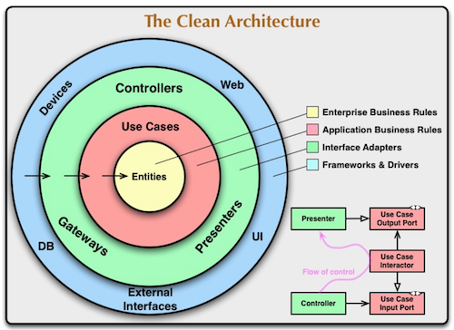
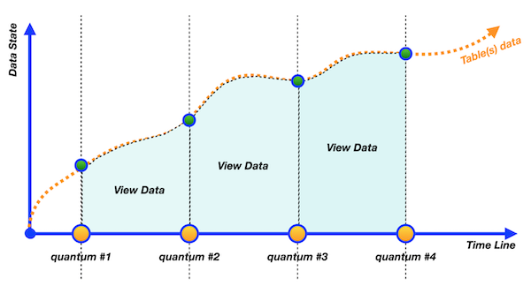
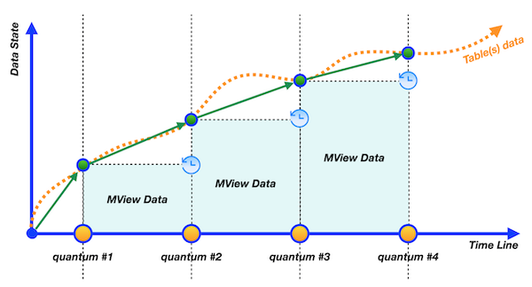

## _Snapshots, virtual tables… What is going on?_

В этом проекте ты научишься создавать и использовать представления (views) для фильтрации данных, генерировать временные диапазоны и находить пропущенные даты, работать с операциями над множествами, рассчитывать скидки и управлять материализованными представлениями, включая их обновление и удаление.

Эти навыки пригодятся в аналитике данных (построение отчетов, сравнение периодов), финансовых расчетах (ценовые анализы) и оптимизации БД (кэширование запросов, управление схемой).

💡 [Нажми сюда](https://new.oprosso.net/p/4cb31ec3f47a4596bc758ea1861fb624), **чтобы поделиться с нами обратной связью на этот проект**. Это анонимно и поможет нашей команде сделать обучение лучше. Рекомендуем заполнить опрос сразу после выполнения проекта.

## Содержание
- [Как учиться в «Школе 21»](#как-учиться-в-школе-21)
- [Chapter I](#chapter-i)
- [Введение](#введение)
- [Chapter II](#chapter-ii)
- [Рекомендации к выполнению этого проекта](#рекомендации-к-выполнению-этого-проекта)
- [Chapter III](#chapter-iii)
- [Задание 00 — Let's create separate views for persons](#задание-00—lets-create-separate-views-for-persons)
- [Задание 01 — From parts to common view](#задание-01—from-parts-to-common-view)
- [Задание 02 — "Store" generated dates in one place](#задание-02—store-generated-dates-in-one-place)
- [Задание 03 — Find missing visit days with Database View](#задание-03—find-missing-visit-days-with-database-view)
- [Задание 04 — Let's find something from Set Theory](#задание-04—lets-find-something-from-set-theory)
- [Задание 05 — Let's calculate a discount price for each person](#задание-05—lets-calculate-a-discount-price-for-each-person)
- [Задание 06 — Materialization from virtualization](#задание-06—materialization-from-virtualization)
- [Задание 07 — Refresh our state](#задание-07—refresh-our-state)
- [Задание 08 — Just clear our database](#задание-08—just-clear-our-database)

## Как учиться в «Школе 21»

- Здесь тебя ждет уникальный образовательный опыт с большим количеством свободы. Ты получаешь задачу и самостоятельно ищешь пути решения, используя любые удобные способы поиска информации - ресурсы Интернета или нейросети (например, GigaChat). Но внимательно относись к качеству информации: проверяй, думай, анализируй, сравнивай.
- Взаимообучение (Peer-to-Peer, P2P) - это обмен знаниями и опытом с другими пирами, где каждый выступает и учителем, и учеником. Такой подход позволяет глубже понять материал, учась друг у друга.
- Чувствуй себя свободно и проси о помощи - вокруг тебя те, кто тоже впервые проходят этот путь. Делись своим опытом и идеями с другими. Присоединяйся к RocketChat, чтобы быть в курсе всех новостей от нашего сообщества.
- Твое обучение не будет иметь никакого смысла, если ты будешь копировать чужие решения. Если пользуешься помощью других - всегда разбирайся до конца, почему, как и зачем. Не бойся ошибиться.
- Кажется, что задача невыполнима? Сделай перерыв, проветрись, перезагрузи голову - это помогало многим. Возможно, после этого решение придет само собой.
- Важен не только результат обучения, но и сам процесс. Нужно не просто решить задачу, а понять, КАК ее решить.

**Как работать с проектом:**

- Перед выполнением проект необходимо склонировать с GitLab в одноименный репозиторий.
- Все файлы необходимо создавать в папке _src/_ склонированного репозитория.
- После клонирования проекта необходимо создать ветку develop и вести разработку в ней. После этого пушить в GitLab также нужно ветку develop.
- В твоей директории не должно быть иных файлов, кроме тех, что обозначены в заданиях.

## Chapter I
## Введение

Зачем нужны виртуальные таблицы и материализованные представления в базах данных? Разве базы данных — это не просто таблицы? Нет, не совсем. Базы данных похожи на объектно-ориентированные языки программирования. Вспомни, сколько абстракций есть в Java (речь о Java-интерфейсах). Абстракция нужна для достижения «чистой архитектуры» и замены объектов с минимальным влиянием на зависимости (иногда это работает :-)).

Более того, в реляционных базах данных существует особый архитектурный шаблон — ANSI/SPARC. Он разделяет объекты на три уровня:

- внешний уровень,
- концептуальный уровень,
- внутренний уровень.

Таким образом, можно сказать, что виртуальные таблицы и материализованные представления — это физические интерфейсы между таблицами с данными и пользователем/приложением.

Так в чём же разница между этими двумя объектами? Ключевое отличие — в «актуальности» данных.  
Ниже изучи графическое представление их поведения.

| | |
|------|------|
| Представление (View) — это виртуальный объект, который содержит те же данные, что и базовые таблицы, на основе которых оно создано. Другими словами, когда мы запрашиваем данные из представления, оно перенаправляет наш запрос к исходным таблицам, а затем возвращает нам результат. |  |
|  | Материализованное представление (Materialized View) — это самостоятельный объект базы данных. Другими словами, данные в нем обновляются только при срабатывании «триггерного события» (например, по расписанию). Это означает, что материализованное представление всегда содержит данные с небольшой задержкой относительно текущего состояния базовых таблиц. |

Между представлениями и материализованными представлениями есть еще несколько ключевых различий:

- Виртуальные таблицы (представления) поддерживают операции INSERT/UPDATE/DELETE, но с определенными ограничениями.
- Для виртуальных таблиц можно создавать "INSTEAD OF" триггеры, что позволяет более гибко управлять входящими операциями изменения данных.
- Материализованные представления являются объектами только для чтения (ReadOnly) в контексте операций INSERT/UPDATE/DELETE.
- На материализованные представления можно создавать пользовательские индексы для ускорения выполнения запросов.

## Chapter II
## Рекомендации к выполнению этого проекта

- Убедись, что ты работаешь с последней версией PostgreSQL.
- Ты можешь писать код (SQL-скрипты) в любой удобной IDE - это совершенно нормально.
- В директории должны оставаться только файлы, явно указанные в задании. Настрой .gitignore, чтобы избежать случайных ошибок.
- Убедись, что у тебя есть личная база данных и доступ к ней в твоем кластере PostgreSQL.
- Скачай [скрипт](./materials/model.sql) с моделью базы данных и примени его к своей базе - сделать это можно либо через командную строку с помощью psql, либо через любую удобную IDE, например DataGrip от JetBrains или pgAdmin из сообщества PostgreSQL. **Процесс обучения является инкрементным и линейным, поэтому убедись, что все изменения, которые были внесены в проект SQLB4_DML (Day 03) в ходе заданий 07-13, должны сохраняться (это похоже на реальную ситуацию, когда после выпуска релиза требуется обеспечить согласованность данных для новых изменений).**
- В каждом задании внимательно ознакомься с разделами «Разрешено» и «Запрещено» - там перечислены допустимые опции базы данных, типы, конструкции SQL и другие важные ограничения.
- Да прибудет с тобой сила SQL!
- Приступай к работе - и пусть это будет увлекательно!

Перед выполнением заданий изучи логическую структуру модели базы данных ниже.

1. **Таблица pizzeria** (справочник пиццерий)
   - поле id - первичный ключ
   - поле name - название пиццерии
   - поле rating - средний рейтинг пиццерии (от 0 до 5 баллов)

2. **Таблица person** (справочник клиентов, любящих пиццу)
   - поле id - первичный ключ
   - поле name - имя человека
   - поле age - возраст человека
   - поле gender - пол человека
   - поле address - адрес человека

3. **Таблица menu** (справочник с доступным меню и ценами на конкретные пиццы)
   - поле id - первичный ключ
   - поле pizzeria_id - внешний ключ на таблицу pizzeria
   - поле pizza_name - название пиццы в пиццерии
   - поле price - цена конкретной пиццы

4. **Таблица person_visits** (журнал посещений пиццерий)
   - поле id - первичный ключ
   - поле person_id - внешний ключ на таблицу person
   - поле pizzeria_id - внешний ключ на таблицу pizzeria
   - поле visit_date - дата посещения (например, 2022-01-01)

5. **Таблица person_order** (журнал заказов)
   - поле id - первичный ключ
   - поле person_id - внешний ключ на таблицу person
   - поле menu_id - внешний ключ на таблицу menu
   - поле order_date - дата заказа (например, 2022-01-01)

Посещения пиццерий и заказы - это разные сущности, между которыми нет прямой зависимости в данных. Например, клиент может находиться в одном ресторане, просто просматривая меню, и одновременно сделать заказ в другом ресторане по телефону или через мобильное приложение. Или другой вариант - быть дома и оформить заказ по телефону, не посещая заведение вовсе.

## Chapter III
## Задание 00 — Let's create separate views for persons

| Задание 00: Let's create separate views for persons | |
|----------------------------------------------------|--|
| Директория для загрузки решений | ex00 |
| Файлы для загрузки | `day04_ex00.sql` |
| **Разрешено** | |
| Язык | ANSI SQL |

Создай два представления в базе данных (с атрибутами, аналогичными исходной таблице), реализующие простую фильтрацию персон по полу. Присвойте представлениям соответствующие имена:

- v_persons_female (для лиц женского пола)
- v_persons_male (для лиц мужского пола)

## Задание 01 — From parts to common view

| Задание 01: From parts to common view | |
|--------------------------------------|--|
| Директория для загрузки решений | ex01 |
| Файлы для загрузки | `day04_ex01.sql` |
| **Разрешено** | |
| Язык | ANSI SQL |

Используй 2 представления из Задания 00 и напиши SQL-запрос,  
который выведет имена женщин и мужчин в одном списке.  
Укажи сортировку списка по имени человека.  
Ниже приведен пример вывода.

| name |
|------|
| Andrey |
| Anna |
| ... |

## Задание 02 — "Store" generated dates in one place

| Задание 02: "Store" generated dates in one place | |
|-------------------------------------------------|--|
| Директория для загрузки решений | ex02 |
| Файлы для загрузки | `day04_ex02.sql` |
| **Разрешено** | |
| Язык | ANSI SQL |
| Синтаксические конструкции SQL | `generate_series(...)` |

Создай представление базы данных с именем v_generated_dates, которое будет «хранить» сгенерированные даты с 1 января по 31 января 2022 года в типе DATE.  
Необходимо упорядочить данные по столбцу generated_date.

| generated_date |
|----------------|
| 2022-01-01 |
| 2022-01-02 |
| ... |

## Задание 03 — Find missing visit days with Database View

| Задание 03: Find missing visit days with Database View | |
|-------------------------------------------------------|--|
| Директория для загрузки решений | ex03 |
| Файлы для загрузки | `day04_ex03.sql` |
| **Разрешено** | |
| Язык | ANSI SQL |

Напиши SQL-запрос, который возвращает пропущенные дни посещений людей за январь 2022 года.  
Для этой задачи используй представление v_generated_dates и отсортируй результат по столбцу missing_date.  
Пример вывода данных приведен ниже

| missing_date |
|--------------|
| 2022-01-11 |
| 2022-01-12 |
| ... |

## Задание 04 — Let's find something from Set Theory

| Задание 04: Let's find something from Set Theory | |
|-------------------------------------------------|--|
| Директория для загрузки решений | ex04 |
| Файлы для загрузки | `day04_ex04.sql` |
| **Разрешено** | |
| Язык | ANSI SQL |

Напиши SQL-запрос, реализующий формулу (R − S) ∪ (S − R), где:

- R — таблица person_visits с фильтром по дате 2 января 2022 года,
- S — та же таблица person_visits, но с фильтром по дате 6 января 2022 года.

Вычисления должны выполняться над множествами значений столбца person_id, и в результате должен быть только этот столбец. Отсортируй вывод по person_id и сохрани итоговый запрос в представлении v_symmetric_union.

(\*) Честно говоря, определения «симметричного объединения» в теории множеств не существует. Это авторская интерпретация, основанная на правиле симметрической разности.

## Задание 05 — Let's calculate a discount price for each person

| Задание 05: Let's calculate a discount price for each person | |
|------------------------------------------------------------|--|
| Директория для загрузки решений | ex05 |
| Файлы для загрузки | `day04_ex05.sql` |
| **Разрешено** | |
| Язык | ANSI SQL |

Создай представление `v_price_with_discount`, которое возвращает заказы человека с указанием:

- имени клиента (name),
- названия пиццы (pizza_name),
- реальной цены (price),
- столбца discount_price (рассчитывается по формуле price - price * 0.1, то есть с 10% скидкой).

Отсортируй результаты по имени клиента (name), названию пиццы (pizza_name) и приведи столбец discount_price к целочисленному типу (integer).

Пример результата представлен ниже.

| name | pizza_name | price | discount_price |
|------|------------|-------|----------------|
| Andrey | cheese pizza | 800 | 720 |
| Andrey | mushroom pizza | 1100 | 990 |
| ... | ... | ... | ... |

## Задание 06 — Materialization from virtualization

| Задание 06: Materialization from virtualization | |
|------------------------------------------------|--|
| Директория для загрузки решений | ex06 |
| Файлы для загрузки | `day04_ex06.sql` |
| **Разрешено** | |
| Язык | ANSI SQL |

Создай материализованное представление mv_dmitriy_visits_and_eats (с включенными данными) на основе SQL-запроса, который находит название пиццерии, где Дмитрий был 8 января 2022 года и мог съесть пиццу дешевле 800 рублей (этот запрос можно найти в проекте SQLB3_Retrieving data, Задание 07).

Для самопроверки можешь выполнить SQL-запрос к материализованному представлению mv_dmitriy_visits_and_eats и сравнить результат с предыдущим запросом.

## Задание 07 — Refresh our state

| Задание 07: Refresh our state | |
|------------------------------|--|
| Директория для загрузки решений | ex07 |
| Файлы для загрузки | `day04_ex07.sql` |
| **Разрешено** | |
| Язык | ANSI SQL |
| **Запрещено** | |
| Синтаксические конструкции SQL | Не используй прямые числовые значения для идентификаторов Primary Key, person and pizzeria |

Обновим данные в материализованном представлении mv_dmitriy_visits_and_eats (Задание 06).

- Добавь новый визит Дмитрия, соответствующий условиям представления, но с другой пиццерией (отличной от результата Задания 06)
- Обнови данные в mv_dmitriy_visits_and_eats

## Задание 08 — Just clear our database

| Задание 08: Just clear our database | |
|------------------------------------|--|
| Директория для загрузки решений | ex08 |
| Файлы для загрузки | `day04_ex08.sql` |
| **Разрешено** | |
| Язык | ANSI SQL |

После выполнения всех заданий у тебя осталось несколько виртуальных таблиц и материализованное представление.  
Тебе необходимо их удалить.