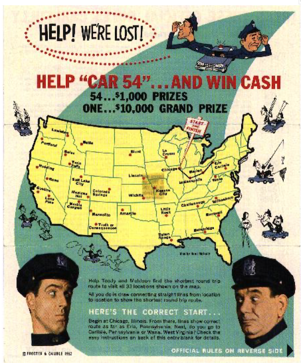
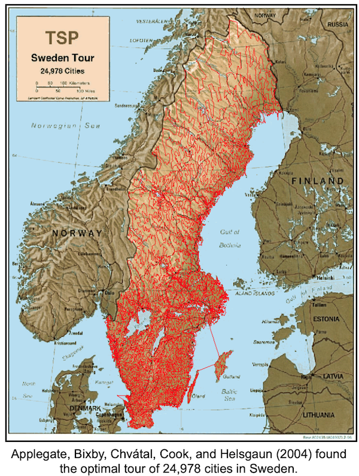
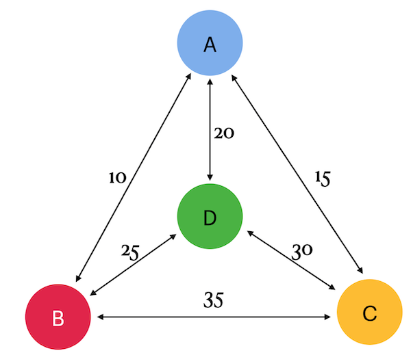

## _Traveling Salesman Problem_

В этом групповом проекте тебе предстоит применить SQL-инструменты для решения классической задачи коммивояжёра (Traveling Salesman Problem). Ты освоишь навыки моделирования графов и маршрутов в SQL, научишься создавать таблицы с узлами и стоимостью перемещений, а также писать запросы для поиска оптимальных путей с минимальными затратами и анализа результатов с сортировкой.

Полученные навыки помогут тебе в дальнейшем решать задачи оптимизации, анализа данных и построения архитектуры информационных систем — востребованные в бизнес-аналитике, разработке программного обеспечения и управлении ИТ-инфраструктурой.

💡 [Нажми сюда](https://new.oprosso.net/p/4cb31ec3f47a4596bc758ea1861fb624), **чтобы поделиться с нами обратной связью на этот проект**. Это анонимно и поможет нашей команде сделать обучение лучше. Рекомендуем заполнить опрос сразу после выполнения проекта.

## Содержание
- [Как учиться в «Школе 21»](#как-учиться-в-школе-21)
- [Chapter I](#chapter-i)
- [Введение](#введение)
- [Chapter II](#chapter-ii)
- [Рекомендации к выполнению этого проекта](#рекомендации-к-выполнению-этого-проекта)
- [Chapter III](#chapter-iii)
- [Задание 00 — Classical TSP](#задание-00—classical-tsp)
- [Задание 01 — Opposite TSP](#задание-01—opposite-tsp)

## Как учиться в «Школе 21»

- Здесь тебя ждет уникальный образовательный опыт с большим количеством свободы. Ты получаешь задачу и самостоятельно ищешь пути решения, используя любые удобные способы поиска информации - ресурсы Интернета или нейросети (например, GigaChat). Но внимательно относись к качеству информации: проверяй, думай, анализируй, сравнивай.
- Взаимообучение (Peer-to-Peer, P2P) - это обмен знаниями и опытом с другими пирами, где каждый выступает и учителем, и учеником. Такой подход позволяет глубже понять материал, учась друг у друга.
- Чувствуй себя свободно и проси о помощи - вокруг тебя те, кто тоже впервые проходят этот путь. Делись своим опытом и идеями с другими. Присоединяйся к RocketChat, чтобы быть в курсе всех новостей от нашего сообщества.
- Твое обучение не будет иметь никакого смысла, если ты будешь копировать чужие решения. Если пользуешься помощью других - всегда разбирайся до конца, почему, как и зачем. Не бойся ошибиться.
- Кажется, что задача невыполнима? Сделай перерыв, проветрись, перезагрузи голову - это помогало многим. Возможно, после этого решение придет само собой.
- Важен не только результат обучения, но и сам процесс. Нужно не просто решить задачу, а понять, КАК ее решить.

**Как работать с проектом:**

- Перед выполнением проект необходимо склонировать с GitLab в одноименный репозиторий.
- Все файлы необходимо создавать в папке _src/_ склонированного репозитория.
- После клонирования проекта необходимо создать ветку develop и вести разработку в ней. После этого пушить в GitLab также нужно ветку develop.
- В твоей директории не должно быть иных файлов, кроме тех, что обозначены в заданиях.

## Chapter I
## Введение

Дано конечное число «городов» и стоимость перемещения между каждой парой городов. Требуется найти самый дешёвый маршрут, позволяющий посетить все города и вернуться в исходную точку.

(На изображении показан конкурс, проведённый компанией Proctor and Gamble в 1962 году. Участникам требовалось решить задачу коммивояжёра для набора из 33 городов. Несколько человек нашли оптимальное решение, и между ними зафиксирована ничья. Одним из победителей стал профессор Джеральд Томпсон из Университета Карнеги-Меллона — один из первых исследователей этой задачи.)

Дан конечный полный граф с целочисленными весами на рёбрах. Требуется найти гамильтонов цикл (то есть цикл, проходящий через все вершины) с минимальным суммарным весом. В данном контексте гамильтоновы циклы также называют турами.

Истоки задачи коммивояжёра (TSP) не до конца ясны. В 1920-х годах математик и экономист Карл Менгер опубликовал её среди своих коллег в Вене. В 1930-х годах эта задача вновь привлекла внимание математиков в Принстоне. В 1940-х годах её изучали статистики (Махаланобис (1940), Йессен (1942), Гош (1948), Маркс (1948)) в контексте сельскохозяйственного применения, а математик Мерилл Флуд популяризировал её среди коллег в корпорации RAND. В конечном счёте, задача коммивояжёра стала известна как прототип сложной задачи комбинаторной оптимизации: исследовать все маршруты по одному невозможно из-за их огромного количества, и долгое время не возникало других идей по эффективному решению.

## Chapter II
## Рекомендации к выполнению этого проекта

- Убедись, что ты работаешь с последней версией PostgreSQL.
- Ты можешь писать код (SQL-скрипты) в любой удобной IDE - это совершенно нормально.
- В директории должны оставаться только файлы, явно указанные в задании. Настрой .gitignore, чтобы избежать случайных ошибок.
- Убедись, что у тебя есть личная база данных и доступ к ней в твоем кластере PostgreSQL.
- В каждом задании внимательно ознакомься с разделами «Разрешено» и «Запрещено» - там перечислены допустимые опции базы данных, типы, конструкции SQL и другие важные ограничения.
- Да прибудет с тобой сила SQL!
- Приступай к работе - и пусть это будет увлекательно!

## Chapter III
## Задание 00 — Classical TSP

| Задание 00: Classical TSP | |
|--------------------------|--|
| Директория для загрузки решений | ex00 |
| Файлы для загрузки | `team00_ex00.sql` DDL for table creation with INSERTs of data; SQL DML statement |
| **Разрешено** | |
| Язык | ANSI SQL |
| Шаблон синтаксиса SQL | Рекурсивный запрос |

Это командный проект. Изучите граф. В нём четыре города (a, b, c и d) и дуги между ними с указанием стоимости (или налогов). На самом деле стоимость одинакова в обе стороны, то есть cost(a, b) = cost(b, a).

Создайте таблицу с названными узлами по структуре {point1, point2, cost} и заполни её данными согласно изображению (не забывай, что между двумя узлами есть пути в обоих направлениях).

Напишите SQL-запрос, который вернет все маршруты (также называемые путями) с минимальной суммарной стоимостью путешествия, если стартовать из города «a». Помните, что нужно найти самый дешевый способ посетить все города и вернуться в исходную точку.

Например, маршрут может выглядеть так: a -> b -> c -> d -> a.

Ниже приведен пример вывода данных.

Отсортируйте результат сначала по total_cost, а затем по маршруту (tour).

| total_cost | tour |
|------------|------|
| 80 | {a,b,d,c,a} |
| ... | ... |

## Задание 01 — Opposite TSP

| Задание 01: Opposite TSP | |
|-------------------------|--|
| Директория для загрузки решений | ex01 |
| Файлы для загрузки | `team00_ex01.sql` SQL DML statement |
| **Разрешено** | |
| Язык | ANSI SQL |
| Шаблон синтаксиса SQL | Рекурсивный запрос |

Добавьте возможность вывести дополнительные строки с самой высокой стоимостью к SQL-запросу из предыдущего упражнения.  
Ознакомьтесь с приведенным ниже примером данных.  
Отсортируйте результат сначала по total_cost, а затем по маршруту (tour).

| total_cost | tour |
|------------|------|
| 80 | {a,b,d,c,a} |
| ... | ... |
| 95 | {a,d,c,b,a} |