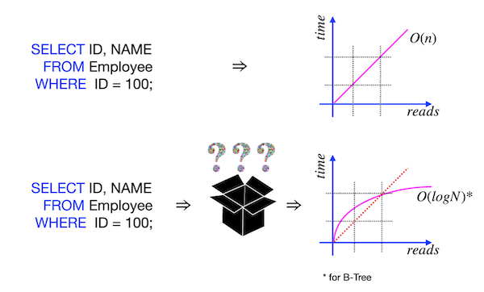
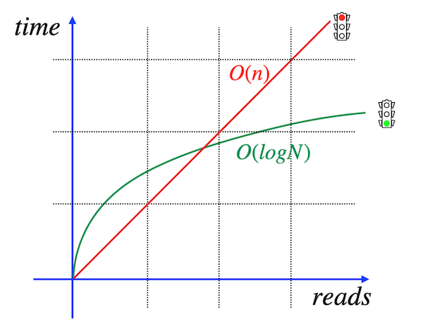
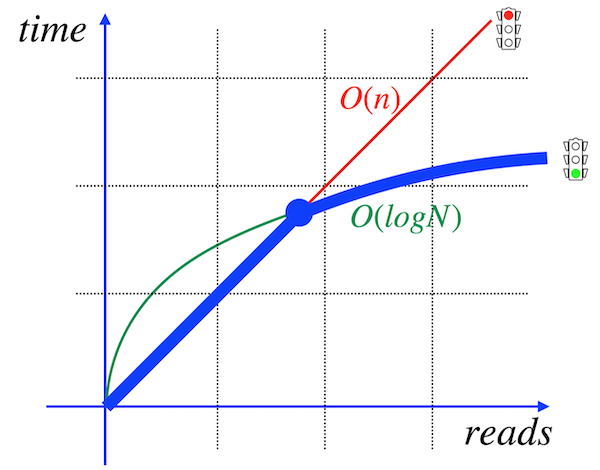

## _I improved my SQL Query! Please, provide proof!_

В этом проекте ты освоишь продвинутые техники работы с индексами PostgreSQL: ты научишься создавать разные типы индексов, анализировать запросы и оптимизировать их так, чтобы все работало максимально быстро.

Эти навыки пригодятся, когда нужно будет ускорить медленные отчеты, снизить нагрузку на сервер, гарантировать уникальность данных (например, чтобы в одном ресторане не было двух пицц с одинаковым названием) или просто сделать так, чтобы пользователи твоего приложения не ждали лишнюю секунду там, где можно ответить мгновенно.

💡 [Нажми сюда](https://new.oprosso.net/p/4cb31ec3f47a4596bc758ea1861fb624) **чтобы поделиться с нами обратной связью на этот проект**. Это анонимно и поможет нашей команде сделать обучение лучше. Рекомендуем заполнить опрос сразу после выполнения проекта.

## Содержание

- [Как учиться в «Школе 21»](#как-учиться-в-школе-21)
- [Chapter I](#chapter-i)
- [Введение](#введение)
- [Chapter II](#chapter-ii)
- [Рекомендации к выполнению этого проекта](#рекомендации-к-выполнению-этого-проекта)
- [Chapter III](#chapter-iii)
- [Задание 00 — Let’s create indexes for every foreign key](#задание-00--lets-create-indexes-for-every-foreign-key)
- [Задание 01 — How to see that index works?](#задание-01--how-to-see-that-index-works)
- [Задание 02 — Formula is in the index. Is it Ok?](#задание-02--formula-is-in-the-index-is-it-ok)
- [Задание 03 — Multicolumn index for our goals](#задание-03--multicolumn-index-for-our-goals)
- [Задание 04 — Uniqueness for data](#задание-04--uniqueness-for-data)
- [Задание 05 — Partial uniqueness for data](#задание-05--partial-uniqueness-for-data)
- [Задание 06 — Let’s make performance improvement](#задание-06--lets-make-performance-improvement)

## Как учиться в «Школе 21» 

* Здесь тебя ждет уникальный образовательный опыт с большим количеством свободы. Ты получаешь задачу и самостоятельно ищешь пути решения, используя любые удобные способы поиска информации - ресурсы Интернета или нейросети (например, GigaChat). Но внимательно относись к качеству информации: проверяй, думай, анализируй, сравнивай.  
* Взаимообучение (Peer-to-Peer, P2P) - это обмен знаниями и опытом с другими пирами, где каждый выступает и учителем, и учеником. Такой подход позволяет глубже понять материал, учась друг у друга.  
* Чувствуй себя свободно и проси о помощи - вокруг тебя те, кто тоже впервые проходят этот путь. Делись своим опытом и идеями с другими. Присоединяйся к RocketChat, чтобы быть в курсе всех новостей от нашего сообщества.  
* Твое обучение не будет иметь никакого смысла, если ты будешь копировать чужие решения. Если пользуешься помощью других - всегда разбирайся до конца, почему, как и зачем. Не бойся ошибиться.  
* Кажется, что задача невыполнима? Сделай перерыв, проветрись, перезагрузи голову - это помогало многим. Возможно, после этого решение придет само собой.  
* Важен не только результат обучения, но и сам процесс. Нужно не просто решить задачу, а понять, КАК ее решить.

Как работать с проектом:

* Перед выполнением проект необходимо склонировать с GitLab в одноименный репозиторий.  
* Все файлы необходимо создавать в папке *src/* склонированного репозитория.  
* После клонирования проекта необходимо создать ветку develop и вести разработку в ней. После этого пушить в GitLab также нужно ветку develop.  
* В твоей директории не должно быть иных файлов, кроме тех, что обозначены в заданиях.

## Chapter I
## Введение

Как индексирование ускоряет работу? Почему одна и та же SQL-запрос с индексом и без индекса имеет разное количество TPS (транзакций в секунду)? 

На самом деле, с «пользовательской точки зрения» индекс - это просто «черный ящик» с магией внутри. С «математической точки зрения» индекс - это просто организованная структура, и никакой магии здесь нет.

Давай рассмотрим причину, почему индекс существует, но не используется.

|  |  |
| ------ | ------ |
|Изучи изображение: красная линия показывает линейное время поиска данных по запросу. Иными словами, если нужно что-то найти, приходится просматривать каждый блок, страницу, кортеж и формировать список искомых строк. (Этот процесс называется «последовательное сканирование»). На самом деле, если ты создаешь индекс B-дерева (BTree), то скорость поиска значительно улучшается. Зеленая линия соответствует времени поиска с логарифмической сложностью. Представь, что у тебя есть 1 000 000 строк, и для поиска одной строки без индекса требуется, скажем, 1 секунда. Тогда на полный поиск уйдет 1 000 000 секунд. С индексом же время будет примерно равно ln(1 000 000) ≈ 14 секундам. |  |
|  | Но почему же индекс не работает? Есть несколько причин, но основная связана с общим количеством строк в индексируемой таблице. Посмотри на изображение - жирной синей линией выделен путь для алгоритмов поиска. Как видно, в начале линейное время является более подходящим для алгоритмов, чем использование логарифмического поиска. Как найти эту точку пересечения? Проводить эксперименты, бенчмарки и ... полагаться на интуицию. Абсолютно никаких формул. Поэтому, если ты хочешь сравнить результаты своих поисков, иногда приходится явно отключать последовательное сканирование. Например, в PostgreSQL существует специальная команда set enable_seqscan = off. |

## Chapter II
## Рекомендации к выполнению этого проекта

- Убедись, что ты работаешь с последней версией PostgreSQL.  
- Ты можешь писать код (SQL-скрипты) в любой удобной IDE - это совершенно нормально.  
- В директории должны оставаться только файлы, явно указанные в задании. Настрой `.gitignore`, чтобы избежать случайных ошибок.  
- Убедись, что у тебя есть личная база данных и доступ к ней в твоем кластере PostgreSQL.  
- Cкачай [скрипт](materials/model.sql) из папки Materials с моделью базы данных и примени его к своей базе - сделать это можно либо через командную строку с помощью psql, либо через любую удобную IDE, например DataGrip от JetBrains или pgAdmin из сообщества PostgreSQL. **Процесс обучения является инкрементным и линейным, поэтому убедись, что все изменения, которые были внесены в проект SQLB4_DML (Day 03) в ходе заданий 07-13, должны сохраняться (это похоже на реальную ситуацию, когда после выпуска релиза требуется обеспечить согласованность данных для новых изменений).**  
- В каждом задании внимательно ознакомься с разделами «Разрешено» и «Запрещено» - там перечислены допустимые опции базы данных, типы, конструкции SQL и другие важные ограничения.  
- Да прибудет с тобой сила SQL 
- Приступай к работе - и пусть это будет увлекательно!

Перед выполнением заданий изучи логическую структуру модели базы данных ниже.

1. Таблица **pizzeria** (справочник пиццерий)
- поле id - первичный ключ  
- поле name - название пиццерии  
- поле rating - средний рейтинг пиццерии (от 0 до 5 баллов)

2. Таблица **person** (справочник клиентов, любящих пиццу)
- поле id - первичный ключ  
- поле name - имя человека  
- поле age - возраст человека  
- поле gender - пол человека  
- поле address - адрес человека

3. Таблица **menu** (справочник с доступным меню и ценами на конкретные пиццы)
- поле id - первичный ключ  
- поле pizzeria_id - внешний ключ на таблицу pizzeria  
- поле pizza_name - название пиццы в пиццерии  
- поле price - цена конкретной пиццы

4. Таблица **person_visits** (журнал посещений пиццерий)
- поле id - первичный ключ  
- поле person_id - внешний ключ на таблицу person  
- поле pizzeria_id - внешний ключ на таблицу pizzeria  
- поле visit_date - дата посещения (например, 2022-01-01)

5. Таблица **person_order** (журнал заказов)
- поле id - первичный ключ  
- поле person_id - внешний ключ на таблицу person  
- поле menu_id - внешний ключ на таблицу menu  
- поле order_date - дата заказа (например, 2022-01-01)

Посещения пиццерий и заказы - это разные сущности, между которыми нет прямой зависимости в данных. Например, клиент может находиться в одном ресторане, просто просматривая меню, и одновременно сделать заказ в другом ресторане по телефону или через мобильное приложение. Или другой вариант - быть дома и оформить заказ по телефону, не посещая заведение вовсе.

## Chapter III
## Задание 00 — Let’s create indexes for every foreign key

| Задание 00: Let’s create indexes for every foreign key |                                                                                                                          |
|---------------------------------------|--------------------------------------------------------------------------------------------------------------------------|
| Директория для загрузки решений       | ex00                                                                                                                     |
| Файлы для загрузки                    | `day05_ex00.sql`                                                                                 |
| **Разрешено**                         |                                                                                                                          |
| Язык                                  | ANSI SQL                                                                                              |
Создай простой BTree index для каждого внешнего ключа в нашей базе данных.

Шаблон имени должен соответствовать следующему правилу: idx_{имя_таблицы}_{имя_столбца}.

Например, имя индекса типа B-дерево для столбца pizzeria_id в таблице `menu` будет `idx_menu_pizzeria_id`.

## Задание 01 — How to see that index works?

| Задание 01: How to see that index works? |                                                                                                                          |
|---------------------------------------|--------------------------------------------------------------------------------------------------------------------------|
| Директория для загрузки решений       | ex01                                                                                                                     |
| Файлы для загрузки                    | `day05_ex01.sql`                                                                                 |
| **Разрешено**                         |                                                                                                                          |
| Язык                                  | ANSI SQL                                                                                              |

Прежде чем продолжить, напиши SQL-запрос, который возвращает названия пицц и соответствующие названия пиццерий.

Ознакомься с примером ожидаемого результата ниже (сортировка не требуется).

| pizza_name | pizzeria_name | 
| ------ | ------ |
| cheese pizza | Pizza Hut |
| ... | ... |

Необходимо убедиться, что индексы работают для твоего SQL-запроса. 

В качестве доказательства потребуется вывод команды `EXPLAIN ANALYZE`.

Ознакомься с примером вывода этой команды:
    
    ...
    ->  Index Scan using idx_menu_pizzeria_id on menu m  (...)
    ...

**Подсказка**: Подумай, почему твои индексы могут не использоваться напрямую, и что нужно сделать, чтобы их задействовать?

## Задание 02 — Formula is in the index. Is it Ok?

| Задание 02: Formula is in the index. Is it Ok? |                                                                                                                          |
|---------------------------------------|--------------------------------------------------------------------------------------------------------------------------|
| Директория для загрузки решений       | ex02                                                                                                                     |
| Файлы для загрузки                    | `day05_ex02.sql`                                                                                 |
| **Разрешено**                         |                                                                                                                          |
| Язык                                  | ANSI SQL                                                                                              |

Создай функциональный B-Tree index с именем `idx_person_name` по столбцу `name` таблицы person. Индекс должен содержать имена людей в верхнем регистре.

Напишите и предоставьте любой SQL-запрос с доказательством работы индекса (`EXPLAIN ANALYZE`), демонстрирующим, что индекс idx_person_name используется.

## Задание 03 — Multicolumn index for our goals

| Задание 03: Multicolumn index for our goals |                                                                                                                          |
|---------------------------------------|--------------------------------------------------------------------------------------------------------------------------|
| Директория для загрузки решений       | ex03                                                                                                                     |
| Файлы для загрузки                    | `day05_ex03.sql`                                                                                 |
| **Разрешено**                         |                                                                                                                          |
| Язык                                  | ANSI SQL                                                                                              |

Создай улучшенный многоколоночный B-Tree index с именем `idx_person_order_multi` для приведенного ниже SQL-запроса.

    SELECT person_id, menu_id,order_date
    FROM person_order
    WHERE person_id = 8 AND menu_id = 19;

Команда `EXPLAIN ANALYZE` должна вернуть план выполнения, соответствующий следующему шаблону. Обрати особое внимание на использование сканирования "Index Only Scan"!

    Index Only Scan using idx_person_order_multi on person_order ...

Предоставь любой SQL-запрос с доказательством работы индекса (`EXPLAIN ANALYZE`), демонстрирующим, что индекс `idx_person_order_multi` используется.

## Задание 04 — Uniqueness for data

| Задание 04: Uniqueness for data |                                                                                                                          |
|---------------------------------------|--------------------------------------------------------------------------------------------------------------------------|
| Директория для загрузки решений       | ex04                                                                                                                     |
| Файлы для загрузки                    | `day05_ex04.sql`                                                                                 |
| **Разрешено**                         |                                                                                                                          |
| Язык                                  | ANSI SQL                                                                                              |

Cоздай уникальный B-Tree index с именем `idx_menu_unique` для таблицы `menu` для столбцов `pizzeria_id` и `pizza_name`. 

Напиши и предоставь любой SQL-запрос с доказательством работы индекса (`EXPLAIN ANALYZE`), демонстрирующим, что индекс `idx_menu_unique` используется.

## Задание 05 — Partial uniqueness for data

| Задание 05: Partial uniqueness for data данных |                                                                                                                          |
|---------------------------------------|--------------------------------------------------------------------------------------------------------------------------|
| Директория для загрузки решений       | ex05                                                                                                                     |
| Файлы для загрузки                    | `day05_ex05.sql`                                                                                 |
| **Разрешено**                         |                                                                                                                          |
| Язык                                  | ANSI SQL                                                                                              |

Создай частично уникальный B-Tree index с именем `idx_person_order_order_date` на таблице `person_order` для атрибутов `person_id` и `menu_id` с частичной уникальностью по столбцу `order_date` для даты '2022-01-01'.

Команда `EXPLAIN ANALYZE` должна возвращать следующий шаблон:

    Index Only Scan using idx_person_order_order_date on person_order …

## Задание 06 — Let’s make performance improvement

| Задание 06: Let’s make performance improvement |                                                                                                                          |
|---------------------------------------|--------------------------------------------------------------------------------------------------------------------------|
| Директория для загрузки решений       | ex06                                                                                                                     |
| Файлы для загрузки                    | `day05_ex06.sql`                                                                                 |
| **Разрешено**                         |                                                                                                                          |
| Язык                                  | ANSI SQL                                                                                              |

Проанализируй приведенный ниже SQL-запрос с технической точки зрения (не обращай внимания на логическую составляющую этого оператора).

    SELECT
        m.pizza_name AS pizza_name,
        max(rating) OVER (PARTITION BY rating ORDER BY rating ROWS BETWEEN UNBOUNDED PRECEDING AND UNBOUNDED FOLLOWING) AS k
    FROM  menu m
    INNER JOIN pizzeria pz ON m.pizzeria_id = pz.id
    ORDER BY 1,2;

Создай новый B-Tree index с именем `idx_1`, который должен улучшить показатель «Время выполнения» (Execution Time) этого запроса. Предоставь доказательства улучшения с помощью команды `EXPLAIN ANALYZE`.

**Подсказка**: Это задание похоже на задачу "метода грубой силы" для поиска хорошего покрывающего индекса (covering index), поэтому перед каждым новым тестом удаляй индекс `idx_1`.

Пример моего улучшения:

**До**:

    Sort  (cost=26.08..26.13 rows=19 width=53) (actual time=0.247..0.254 rows=19 loops=1)
    "  Sort Key: m.pizza_name, (max(pz.rating) OVER (?))"
    Sort Method: quicksort  Memory: 26kB
    ->  WindowAgg  (cost=25.30..25.68 rows=19 width=53) (actual time=0.110..0.182 rows=19 loops=1)
            ->  Sort  (cost=25.30..25.35 rows=19 width=21) (actual time=0.088..0.096 rows=19 loops=1)
                Sort Key: pz.rating
                Sort Method: quicksort  Memory: 26kB
                ->  Merge Join  (cost=0.27..24.90 rows=19 width=21) (actual time=0.026..0.060 rows=19 loops=1)
                        Merge Cond: (m.pizzeria_id = pz.id)
                        ->  Index Only Scan using idx_menu_unique on menu m  (cost=0.14..12.42 rows=19 width=22) (actual time=0.013..0.029 rows=19 loops=1)
                            Heap Fetches: 19
                        ->  Index Scan using pizzeria_pkey on pizzeria pz  (cost=0.13..12.22 rows=6 width=15) (actual time=0.005..0.008 rows=6 loops=1)
    Planning Time: 0.711 ms
    Execution Time: 0.338 ms

**После**:

    Sort  (cost=26.28..26.33 rows=19 width=53) (actual time=0.144..0.148 rows=19 loops=1)
    "  Sort Key: m.pizza_name, (max(pz.rating) OVER (?))"
    Sort Method: quicksort  Memory: 26kB
    ->  WindowAgg  (cost=0.27..25.88 rows=19 width=53) (actual time=0.049..0.107 rows=19 loops=1)
            ->  Nested Loop  (cost=0.27..25.54 rows=19 width=21) (actual time=0.022..0.058 rows=19 loops=1)
                ->  Index Scan using idx_1 on …
                ->  Index Only Scan using idx_menu_unique on menu m  (cost=0.14..2.19 rows=3 width=22) (actual time=0.004..0.005 rows=3 loops=6)
    …
    Planning Time: 0.338 ms
    Execution Time: 0.203 ms